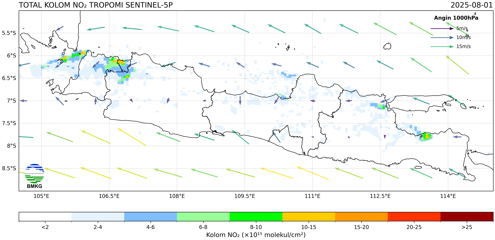

# Sentinel-5P NO2 Daily Analysis for Indonesia

This repository contains a suite of Python scripts designed to automate the daily download, processing, analysis, and visualization of Sentinel-5P TROPOMI NO2 data over Indonesia. The workflow also incorporates wind data to provide a more comprehensive analysis of pollution transport and generates daily reports in various formats.



## Features

- **Automated Data Acquisition**: Downloads daily Sentinel-5P L2 NO2 data from the Copernicus Data Space Ecosystem.
- **Wind Data Integration**: Fetches wind data from the CAMS global atmospheric composition forecasts.
- **Advanced Data Processing**: Merges data tiles, performs spatial interpolation (linear and cubic), and handles data cleaning.
- **Comprehensive Analysis**:
    - Detects high-pollution hotspots.
    - Calculates regional NO2 averages for provinces and cities in Java.
    - Generates data for wind rose diagrams.
- **Rich Visualization**: Creates high-quality maps of NO2 concentrations with wind vector overlays and administrative boundaries.
- **Automated Reporting**: Generates daily reports in Indonesian, including short summaries, executive summaries, and detailed technical reports.
- **Automated Workflow**: A master shell script (`00-autorun-sentinel-no2.sh`) orchestrates the entire daily workflow.
- **File Management**: Automatically transfers generated images and reports to a web server and archives NetCDF files to Google Drive.

## Workflow

The entire process is automated via the `00-autorun-sentinel-no2.sh` script, which executes the following steps in sequence:

1.  **Activate Environment**: Activates the Python virtual environment.
2.  **Download & Process NO2 Data**: `01-sentinel-no2-final.py` downloads, merges, and interpolates the daily NO2 data.
3.  **Download Wind Data**: `02-get-wind.py` downloads the corresponding wind data.
4.  **Visualize Data**: `03-visualize-no2.py` creates the final map visualization with NO2 concentrations and wind arrows.
5.  **Quick Analysis (ID)**: `04-analisis-cepat-id.py` performs a rapid analysis of the generated image to identify hotspots and generate Indonesian language reports.
6.  **Generate Windrose Data**: `05-generate-windrose-data.py` processes the wind NetCDF file to create JSON data for wind rose plots.
7.  **Calculate Regional Averages**: `06-region-average.py` computes the average NO2 concentrations for provinces and cities across Java.
8.  **File Transfer**: Transfers the output files (`png`, `json`, `txt`) to a specified web server.
9.  **Archive Data**: Uploads the raw NetCDF data files (`.nc`) to a Google Drive folder using `rclone`.

## Scripts Description

-   `code/00-autorun-sentinel-no2.sh`: The main automation script that runs the entire daily workflow.
-   `code/01-sentinel-no2-final.py`: Downloads Sentinel-5P NO2 data, divides the Indonesian region into smaller boxes for processing, merges the results, and performs linear and cubic interpolation.
-   `code/02-get-wind.py`: Retrieves wind data (U and V components) from the CAMS forecast.
-   `code/03-visualize-no2.py`: Generates a PNG map visualizing the processed NO2 data, overlaid with wind vectors and administrative boundaries.
-   `code/04-analisis-cepat-id.py`: A comprehensive script that analyzes the generated PNG, identifies hotspots with geographic mapping, and uses `report_generator_id.py` to create text reports in Indonesian.
-   `code/05-generate-windrose-data.py`: Processes wind data to generate binned speed and direction data in JSON format, suitable for creating wind rose charts.
-   `code/06-region-average.py`: Calculates and saves the average NO2 concentration for predefined administrative regions (provinces/cities in Java).
-   `code/report_generator_id.py`: A helper module to generate formatted text reports (short, executive, detailed) in Indonesian from a JSON analysis file.
-   `code/tropomi_analyzer.py`: A general-purpose TROPOMI image analyzer for detecting hotspots and calculating statistics.
-   `code/xx-sentinel-no2-date.py`: A utility script to run the NO2 data processing for a specific historical date.
-   `code/yy-get-wind-date.py`: A utility script to download wind data for a specific historical date.

## Prerequisites

-   Python 3.x
-   A virtual environment (recommended)
-   `sshpass` for automated SCP file transfers
-   `rclone` configured for Google Drive access
-   Required Python packages are listed in `requirements.txt` (you may need to create this file based on the imports in the scripts). Key packages include:
    -   `openeo`
    -   `xarray`
    -   `numpy`
    -   `netCDF4`
    -   `scipy`
    -   `geopandas`
    -   `shapely`
    -   `cdsapi`
    -   `matplotlib`
    -   `cartopy`
    -   `Pillow`
    -   `rasterio`

## Installation

1.  **Clone the repository:**
    ```bash
    git clone [https://github.com/alberthnahas/sentinel-no2-daily.git](https://github.com/alberthnahas/sentinel-no2-daily.git)
    cd sentinel-no2-daily
    ```

2.  **Create and activate a virtual environment:**
    ```bash
    python3 -m venv tropomi_analyzer
    source tropomi_analyzer/bin/activate
    ```

3.  **Install the required Python packages:**
    ```bash
    pip install openeo xarray numpy netCDF4 scipy geopandas shapely cdsapi matplotlib cartopy Pillow rasterio
    ```

4.  **Set up Copernicus Climate Data Store (CDS) API key:**
    -   Register on the [CDS website](https://cds.climate.copernicus.eu/).
    -   Create a `.cdsapirc` file in your home directory with your UID and API key:
        ```
        url: [https://cds.climate.copernicus.eu/api/v2](https://cds.climate.copernicus.eu/api/v2)
        key: YOUR_UID:YOUR_API_KEY
        ```

5.  **Configure `rclone`:**
    -   Follow the instructions at [rclone.org](https://rclone.org/drive/) to configure access to your Google Drive account.

## Usage

1.  **Configure the Autorun Script**:
    -   Open `code/00-autorun-sentinel-no2.sh` and modify the following variables for your environment:
        -   `maindir`: The root directory of this project.
        -   `webuser`, `webhost`, `webbase`, `webpass`: Your web server's SSH credentials.
        -   `TARGET`: The `rclone` remote and folder path for NetCDF backups.

2.  **Run the daily analysis:**
    ```bash
    bash code/00-autorun-sentinel-no2.sh
    ```

3.  **To process data for a specific date:**
    ```bash
    python3 code/xx-sentinel-no2-date.py YYYY-MM-DD
    python3 code/yy-get-wind-date.py YYYY-MM-DD
    # ... then run the other scripts manually for that date
    ```

## Generated Outputs

The workflow generates files in the following directories:

-   `nc/`: Contains the downloaded and processed NetCDF files for NO2 and wind data.
-   `png/`: Contains the final visualization map and analysis charts.
-   `json/`: Contains structured JSON files with analysis results, regional averages, and windrose data.
-   `txt/`: Contains the final text reports in Indonesian.

### Example Output Files:

-   `png/NO2_Indonesia_Daily_20250801_linear_interp.png`
-   `json/hasil_analisis_20250801.json`
-   `json/region_avg_20250801.json`
-   `json/windrose_data_20250801.json`
-   `txt/ringkasan_singkat_id_20250801.txt`
-   `txt/ringkasan_eksekutif_id_20250801.txt`
-   `txt/laporan_detail_id_20250801.txt`

## License

This project is licensed under the GNU General Public License v3.0. See the [LICENSE](LICENSE) file for details.
